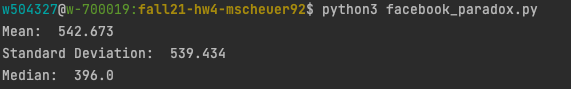
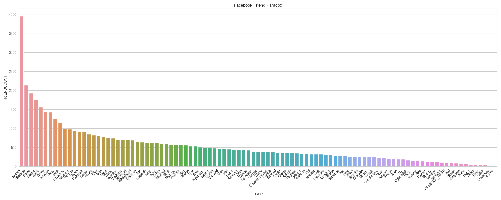
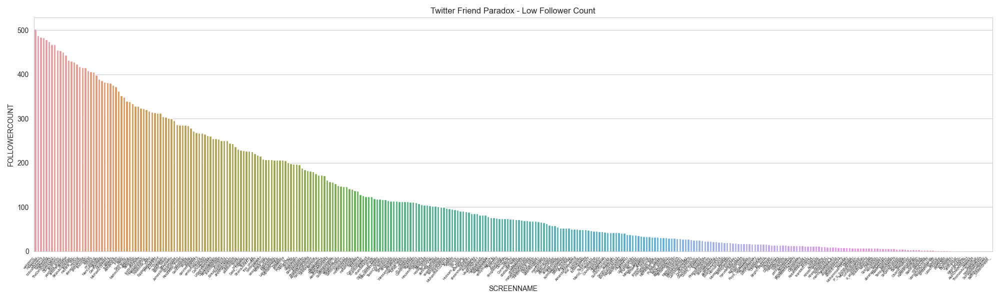
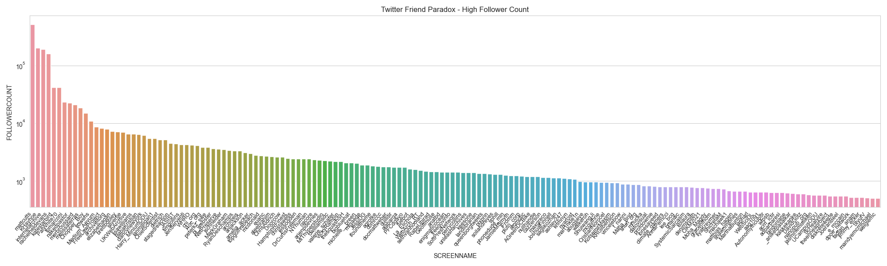
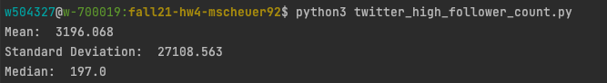

# Friendship Paradox Analyzer

### What is the Friendship Paradox?
The friendship paradox states that most people have fewer friends then their friends on average. This was first analyzed by Scott L. Feld in 1991.

This project analyzes the friendship paradox for:
* A sample of Facebook friends for a single user.
* A Twitter account, where the number a single user's followers was collected, then the number of their followers, followers was collected.


### Data Set 1: Facebook Friendship Paradox

The `facebook_paradox.py` script calculates the mean, standard deviation, and median of the number of friends users have. See below for mean, standard deviation, and median.

```python
# facebook_paradox.py

# Michelle Scheuer
#10/24/2021

import matplotlib.pyplot as plt
import seaborn as sns
import pandas as pd

# Set style and configuration of bar plot
sns.set_style("whitegrid")
plt.figure(figsize=(20, 8))
plt.title("Facebook Friend Paradox")

# Read in unsorted CSV and get the number of friends for the user
df = pd.read_csv("HW4-friend-count.csv")
user_friendcount = len(df) + 1 # add +1 to account for element 0

# Search for original user in file (in case script has been run more than once),
# and add it to the file if it's not there.
with open('files/fb_friend_count.csv') as f:
    if 'ORIGINAL_USER,99' not in f.read():
        fb_friend = open('files/fb_friend_count.csv', 'a')
        fb_friend.write("ORIGINAL_USER,"+str(user_friendcount))
        fb_friend.close()

# Read in updated file
new_df = pd.read_csv("files/fb_friend_count.csv")
sorted_df = new_df.sort_values(by=['FRIENDCOUNT'], ascending=False)

# # Create a bar plot using Seaborn Library
ax = sns.barplot(x='USER', y='FRIENDCOUNT', data=sorted_df)
ax.set_xticklabels(ax.get_xticklabels(), rotation=45, ha="right")
plt.tight_layout()
plt.show()


# Gather data from file that does not include the user and calculate the mean, median, and standard deviation of the friends.
original_df = pd.read_csv('HW4-friend-count.csv')

mean = original_df['FRIENDCOUNT'].mean()
std_dev = original_df['FRIENDCOUNT'].std()
median = original_df['FRIENDCOUNT'].median()

print("Mean: ", round(mean, 3))
print("Standard Deviation: ", round(std_dev, 3))
print("Median: ", round(median, 3))


# Save sorted dataframe that includes the user to file for viewing
sorted_df.to_csv('files/sorted_facebook_friends.csv', index=False)

```

This script reads in `files/fb_friend_count.csv` and `HW4-friend-count.csv` and stores in a pandas table.
* Reads in `HW4-friends-count.csv` and gets the total length. This length is the amount of friends that the user has.
  * I added a "+1" in order to account for the 0 element in the data table. The user would otherwise be shown to have 98 friends, which is incorrect.
* I then open a separate duplicate file that checks if string "ORIGINAL_USER,99" is present. I included this in case the script has been run more than once, as I don't want to keep appending that string to the file.
* Next, the file with the user's friend count is read in and stored in a data table.
* The data table is used to create a bar plot by using the Seaborn library. The original user's friend count is represented as `ORIGINAL_USER` on the x-axis.
* Another data frame is created by reading in `HW4-friend-count.csv`. This file does not contain the original user.
  * Side note, I had a difficult time figuring out how to delete a single line from a file, this is why I created a `fb_friend_count.csv` to add the original user to.
* I calculate the mean, standard deviation, and median from that data, see below image.
The output of this script thus far, and the answer to this question is:



I utilized the Seaborn library to create a bar plot to display descending friend counts.
* The y-axis displays the friend count of each friend.
* The x-axis displays the users and their friend counts.
  * The original user is labeled as `ORIGINAL_USER`
* Data is sorted by line `sorted_df = df.sort_values(by=['FRIENDCOUNT'], ascending=False)`
  * The `ascending=False` argument sorts the data in a descending fashion.
  


The last line of the script prints the sorted data to a file. It can be found in`files/sorted_facebook_friends.txt`.

*Q: Does the friendship paradox hold for this user and their friends on Facebook?*

I would say for the most part, yes the friendship paradox holds. The friendship paradox states that "*Your friends have more friends than you do*".
There are only 10 out of 99 friends who have fewer friends than this user does. That means that 88 out of 99 of the friends have more friends than this user, which is a 
bigger percent chance that the friendship paradox is true.


### Data Set 2: Friendship Paradox on Twitter


```python
# collect_followers.py

# Michelle Scheuer
# 10/26/2021
import os
import sys
import json
import time

# Collect all of the id's of the followers for Dr.Weigle's account
os.popen('twarc followers weiglemc > files/ids.txt')
time.sleep(3)

# collect user data from the original account
os.popen('twarc users weiglemc > files/friend_data.jsonl')

# collect user data from the id's of the followers and append to the file
os.popen('twarc users files/ids.txt >> files/friend_data.jsonl')

# Create a header for the csv file
header = open("files/followers.csv", 'w')
header.write("ID,SCREENNAME,FOLLOWERCOUNT \n")
header.close()

# Use the json user information and extract the id, screenname, and follower count. Print to file.
lines = sys.stdin.readlines()
for line in lines:
    tweet_data = json.loads(line)
    friend_id = tweet_data["id"]
    screen_name = tweet_data["screen_name"]
    follower_count = tweet_data["followers_count"]
    print(str(friend_id) + "," + screen_name + "," + str(follower_count))
```
I utilized a `twarc` command
to get this data can be done through command line arguments, which is referenced in [scholarslab.github.io](https://scholarslab.github.io/learn-twarc/06-twarc-command-basics.html).

To run this script: `python3 collect_followers.py < files/friend_data.jsonl >> files/followers.csv`


This script:
* Uses `twarc followers weiglemc > files/ids.txt` to gather the ID's for each of the followers my account. The ID's can be found in `files/ids.txt`
* Uses `twarc followers weiglemc > files/ids.txt` to collect the user data from the original Twitter account.
* Uses `twarc users files/ids.txt >> files/friend_data.jsonl` to retrieve the json data for each ID, and appends it to `files/friend_data.jsonl` 
* Creates a header for the CSV file before writing  
* The json file is read in, and for each line in the file, the id, screen name, and followers count is retrieved.
* The data is written to `files/followers.csv`

*Q: What is the mean, standard deviation, and median of the number of followers that your followers have?*  

I split the Twitter data into two sections, and wrote two nearly identical scripts to plot the data. They are also both similar to `facebook_paradox.py`.
The main differences between all three are:
* `twitter_high_follower_count.py` uses the parameter `log=true` to set the y-axis to a powers of 10.
  * This script also calculates the mean, standard deviation, and median for the followers of the original account without the original user included in the data.
* `twitter_low_follower_count.py` uses the FRIENDCOUNT data for the y-axis, since that number is 503 and below.

Let's first take a look at `twitter_low_follower_count.py`


```python
# twitter_low_follower_count.py

# Michelle Scheuer
# 10/29/2021

import matplotlib.pyplot as plt
import seaborn as sns
import pandas as pd

sns.set_style("whitegrid")
plt.figure(figsize=(20, 6))
plt.title("Twitter Friend Paradox - Low Follower Count")

# Read in unsorted CSV, sort by highest friendcount
df = pd.read_csv("files/followers_low_count.csv")
sorted_df = df.sort_values(by=['FOLLOWERCOUNT'], ascending=False)

# Create a bar plot using Seaborn Library
ax = sns.barplot(x ="SCREENNAME", y='FOLLOWERCOUNT', data=sorted_df)

ax.set_xticklabels(ax.get_xticklabels(), fontsize=5,rotation=50,ha="right")
plt.tight_layout()
plt.show()
```
This script creates a graph for the users who have followers below that of the original account.
* The data is read into a dataframe  from `files/low_follower_count.py`, and is sorted in descending order.
* Uses the Seaborn library to generate a bar plot based on the user (x-axis), and follower count (y-axis) data from the dataframe.
  * The y-axis uses the number of followers. Since it is not a crazy number it pulls data directly from the `FOLLOWERCOUNT` column in the dataframe.
* I seperated the data found in `files/followers.csv` to get this data. I saved it in `files/followers_low_count.csv`

The graph generated by this script:



### Note: The original account `weiglemc` in the above bar plot is included as the FIRST bar, to demonstrate the amount of users who fall below that number of followers.


The script `twitter_high_follower_count.py` is displayed below:

```python
# twitter_high_follower_count.py

# Michelle Scheuer
# 10/29/2021

import matplotlib.pyplot as plt
import seaborn as sns
import pandas as pd

# Set style and configuration of bar plot
sns.set_style("whitegrid")
plt.figure(figsize=(20, 6))
plt.title("Twitter Friend Paradox - High Follower Count")

# Read in unsorted CSV, sort by highest friendcount
df = pd.read_csv("files/followers_high_count.csv")
sorted_df = df.sort_values(by=['FOLLOWERCOUNT'], ascending=False)

# Create a bar plot using Seaborn Library
ax = sns.barplot(x ="SCREENNAME", y='FOLLOWERCOUNT', data=sorted_df, log=True)
ax.set_yscale("log")
ax.set_xticklabels(ax.get_xticklabels(), fontsize=9,rotation=50,ha="right")
plt.tight_layout()
plt.show()


# mean median and std dev of follower count without orignial user account
original_df = pd.read_csv("files/followers_no_user.csv")
sorted_df = original_df.sort_values(by=['FOLLOWERCOUNT'], ascending=False)

# Save sorted dataframe to file
sorted_df.to_csv('files/sorted_twitter_followers.csv', index=False)

# Calculate the mean, std deviation and median of friendcount
mean = original_df['FOLLOWERCOUNT'].mean()
std_dev = original_df['FOLLOWERCOUNT'].std()
median = original_df['FOLLOWERCOUNT'].median()

print("Mean: ", round(mean, 3))
print("Standard Deviation: ", round(std_dev, 3))
print("Median: ", round(median, 3))

```
This script creates a graph for the users who have followers above that of the original account.
* Reads in data from `files/followers_high_count.csv` and places them into a dataframe, and is sorted in descending order.
* Uses the Seaborn library to generate a bar plot based on the user (x-axis), and follower count (y-axis) data from the dataframe.
    * I used the parameter `log=true`, and set the y-axis scale to `log`, due to the high follower account for some of the followers.

The graph generated by this script:



### Note: The original account `weiglemc` in the above bar plot  is included as the LAST bar, to demonstrate the amount of users who have more followers than the user.

The last part of `twitter_high_follower_count.py`:
* Reads in the file `files/followers_no_user`.
* Sorts the values from ascending follower count, and writes it to `files/sorted_twitter_followers.csv`.
* The mean, standard deviation, and median of the follower count from that file, are then calculated and printed.


The output of the portion of code, 
`print("Mean: ", round(mean, 3))
print("Standard Deviation: ", round(std_dev, 3))
print("Median: ", round(median, 3))`




*Q: Does the friendship paradox hold for you and your followers on Twitter?*

Based on the data collected from this account, the friendship paradox for this account does not exist. The data shows that 343 out of 503 followers had less than the original account. 
That means that ~32% of the followers this account has greater than 503 followers, while ~68% has less than 503 followers. 

### References
[Pandas Dataframe](https://www.kite.com/python/answers/how-to-print-an-entire-pandas-dataframe-in-python)

[Seaborn Barplot 1](https://seaborn.pydata.org/generated/seaborn.barplot.html)

[Seaborn Barplot 2](https://www.geeksforgeeks.org/seaborn-barplot-method-in-python/)

[StackOverflow Seaborn](https://stackoverflow.com/questions/42528921/how-to-prevent-overlapping-x-axis-labels-in-sns-countplot)

[Scholarslab Twarc Documentation](https://scholarslab.github.io/learn-twarc/06-twarc-command-basics.html)

[Python json Documentation](https://www.kite.com/python/answers/how-to-extract-a-value-from-json-in-python)

[Seaborn Documentation](https://www.delftstack.com/howto/seaborn/seaborn-font-size/)
